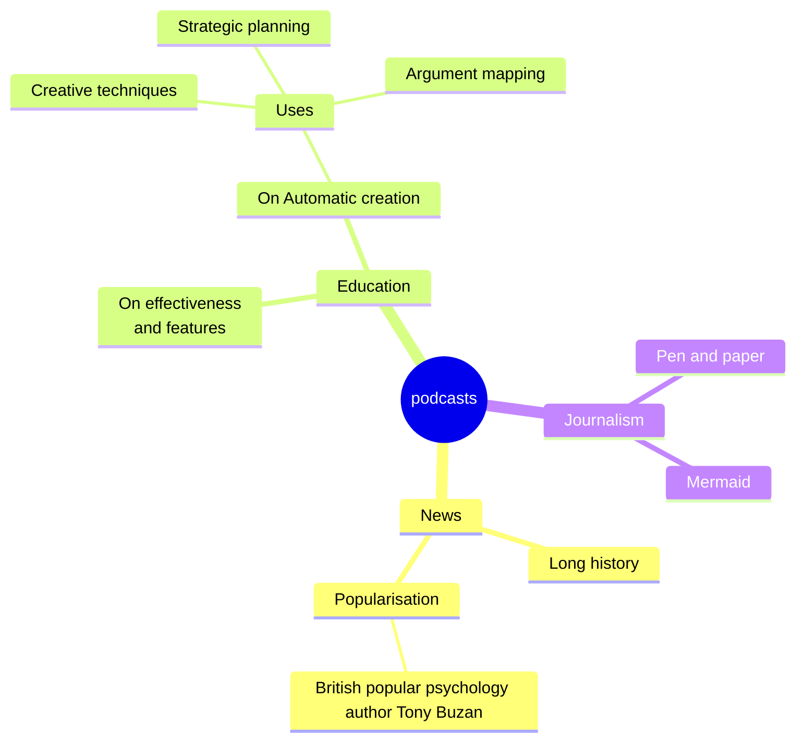

# 2023_nov_22_speech_podcasts
Visionary Communication path’s project “Researching and Presenting.”

```mermaid

mindmap
  root((podcasts))
    News
      Long history
      Popularisation
        British popular psychology author Tony Buzan
    Education
      On effectiveness<br/>and features
      On Automatic creation
        Uses
            Creative techniques
            Strategic planning
            Argument mapping
    Journalism
      Pen and paper
      Mermaid

```

